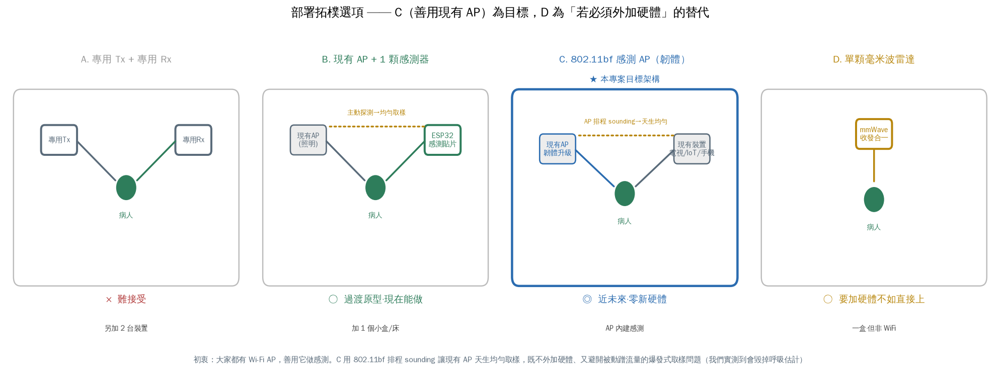
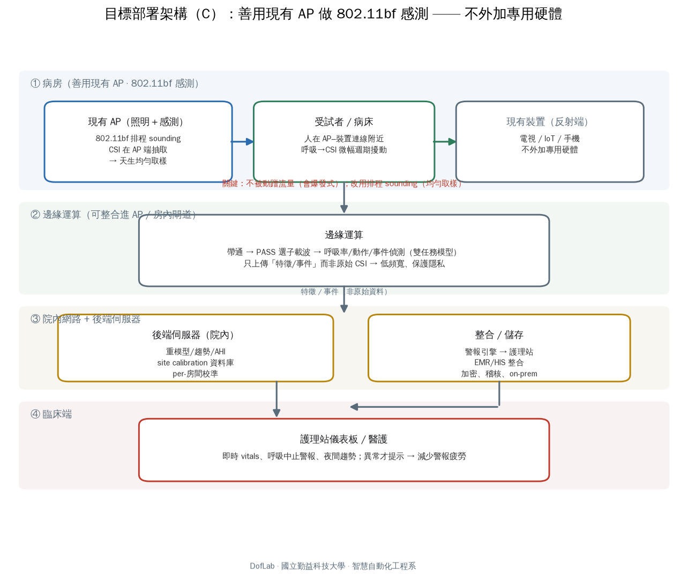

# 部署架構：善用現有 Wi-Fi AP 做感測（System / Deployment）

> 本專案的初衷：**「大家的空間本來就有一台 Wi-Fi AP，何不善用它做點事情。」**
> 因此部署的第一原則是 **不外加專用射頻硬體**——一旦要客戶另外採購一發一收兩台裝置，
> 就失去了相對毫米波雷達的優勢，不如直接用雷達。以下把可行拓樸排出來，並說明本專案
> 選定的目標架構與理由。

## 1. 拓樸選項（由難接受 → 好接受）



| 選項 | 硬體 | 取樣品質 | 廠商/客戶接受度 | 定位 |
|---|---|---|---|---|
| **A. 專用 Tx + 專用 Rx** | 另加 2 台 | 好（可控） | ✗ 低（要多擺兩台） | 只做實驗室驗證 |
| **B. 現有 AP + 1 顆感測器** | 加 1 顆 ESP32 | 好（主動探測） | ○ 中（加一個小盒） | **過渡原型** |
| **C. 802.11bf 感測 AP** | 現有 AP 韌體升級 | 好（AP 排程 sounding，天生均勻） | ◎ 高（幾乎零新硬體） | **★ 目標架構** |
| **D. 單顆毫米波雷達** | 加 1 盒雷達 | 很好 | ○ 中（但要加硬體） | 若必走加硬體路線的替代 |

**選定：C。** 理由——它完全貼合「善用既有 AP」的初衷（不外加硬體），而且 802.11bf（Wi-Fi
Sensing，2024–25 標準化）讓 **AP 自己排程 sounding 幀**，取樣天生均勻，直接解掉我們實測到的
致命問題（見 §3）。**B 是現在就能做的過渡原型**（我們手上的 ESP32 就走這條）；**D（毫米波雷達）
是「如果無論如何都要加硬體」時才考慮的替代**，因為那時 Wi-Fi CSI 相對雷達已無成本優勢。

## 2. 目標架構（C）端到端堆疊



1. **① 病房**：現有 AP 同時當照明與感測（802.11bf 排程 sounding，CSI 在 AP 端抽取）；反射端用
   房內**現有裝置**（電視/IoT/手機），不外加專用硬體。人在 AP–裝置連線附近，呼吸造成 CSI 微幅
   週期擾動。
2. **② 邊緣運算**（可整合進 AP 或房內閘道）：帶通 → PASS 選子載波 → 呼吸率/動作/事件偵測（雙任務
   模型）。**只上傳「特徵/事件」而非原始 CSI** → 低頻寬、保護隱私。
3. **③ 院內後端伺服器**：重模型/趨勢/AHI、site calibration 資料庫（每房間校準）、警報引擎、
   EMR/HIS 整合、加密稽核、**院內處理（on-prem）**。
4. **④ 臨床端**：護理站儀表板、呼吸中止警報；異常才提示 → 減少警報疲勞。

## 3. 為什麼「被動蹭現有 AP 流量」不行——實測證據

用現有 AP 有兩種方式，差別是成敗關鍵：

- **被動蹭既有上網流量（✗）**：封包時序由使用者流量決定 → **爆發式非均勻取樣**。我們在真實
  ESP32 資料上量到：中位數看似 111–125 Hz，實際有效率只有 ~64 Hz（Δt 標準差 > 平均），把它當
  均勻取樣直接估頻，呼吸峰會塌到頻帶邊緣（假的 6 bpm）。見
  [`../real_data/second_batch_20260722/`](../real_data/second_batch_20260722/) 與研究紀錄 §2.15。
- **主動/排程取樣（○）**：B 由感測器主動固定間隔探測、C 由 AP 排程 sounding —— 兩者都讓取樣
  **均勻**，呼吸峰乾淨可估（孿生對比圖 `twin_vs_real.png` 示範乾淨均勻該長什麼樣）。

> 結論：**「用不用現有 AP」不是重點，「怎麼取樣」才是。** 802.11bf 的價值正是把「用現有 AP」
> 和「均勻取樣」同時做到——這讓我們的爆發式取樣發現，從一個踩到的坑變成**支撐架構選型的實證**。

## 4. 其他部署考量

- **多床/多人**：同房多人訊號混疊分離仍難 → 現階段適合單人房或床間隔離；每床一個感測視角。
- **場域校準（C4）**：每房間幾何/材質不同，需 per-room 校準——真實部署的剛需，非加分項。
- **人與連線的相對位置**：人需在 AP–反射端連線附近，耦合才足夠（我們新臥室批次坐姿離線約
  126 cm，訊號偏弱即為一例）。
- **隱私/資安**：CSI 屬健康資料，傾向邊緣預處理 + 院內伺服器、傳輸加密、存取稽核，不上公有雲。
- **Wi-Fi 共存/法規**：與院內網路及醫療儀器的頻道規劃、EMI、（若作診斷用途的）器材認證。

## 重現圖

```bash
cd csi_synth
PYTHONPATH=. python deployment/make_deploy_figs.py   # → figs/topo_options.png, figs/deploy_arch.png
```

*DofLab · 國立勤益科技大學 · 智慧自動化工程系*
